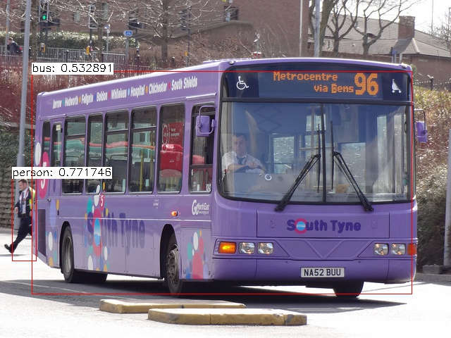
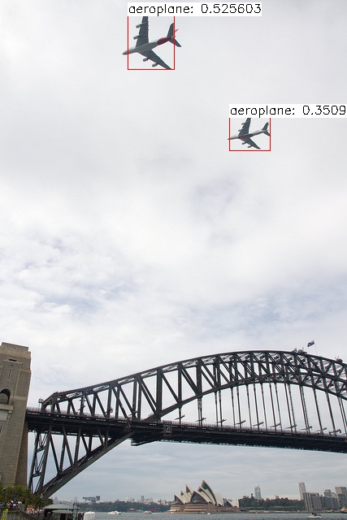
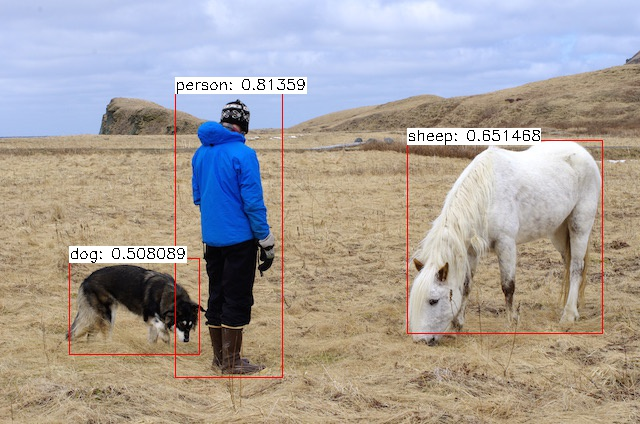

# ncnn-yolo
convert pytorch trained yolo model to ncnn for Flexible deployment

## Introduction

We use pytorch_0.2 to train our model, it's advantages are very flexible. Then we use [PytorchConvert](https://github.com/starimeL/PytorchConverter) convert our model to ncnn.

[ncnn](https://github.com/Tencent/ncnn) is a high-performance neural network inference computing framework optimized for mobile platforms. With it, we can easily deploy deep learning algorithm models to the mobile platform.

## workflow

1. train yolov1 model, we use this reposity [pytorch-YOLO-v1](https://github.com/xiongzihua/pytorch-YOLO-v1), **attention**, we must use **ceil_mode=True** when pooling is used.

2. Convert model

3. check the output is correct or not, write decoder in c/c++

## how to
**step1**
```shell
cd pytorch-yolo-v1
python train.py
```
best.pth will produced in /pytorch-yolo-v1

**step2**
```shell
cd pytorchConvert/code
python run.py
```
converted model will in /pytorchConvert/ModelFiles/ResNet/

our model name is ResNet, because we use resnet50 as backbone, and I forget change class name, anyway, rename it to yolo1.param and yolo1.bin

**step3**
```shell
cd ncnn
mkdir build
cd build
cmake ..
make -j4
```

uncomment add_subdirectory(examples) in ncnn/CMakeLists.txt
```shell
cd build
cmake ..
make -j4
```
copy yolo1.param yolo1.bin to build/examples

```shell
cd build
cd examples
./xiong_yolo1 person.jpg
```
## Hopeful results




